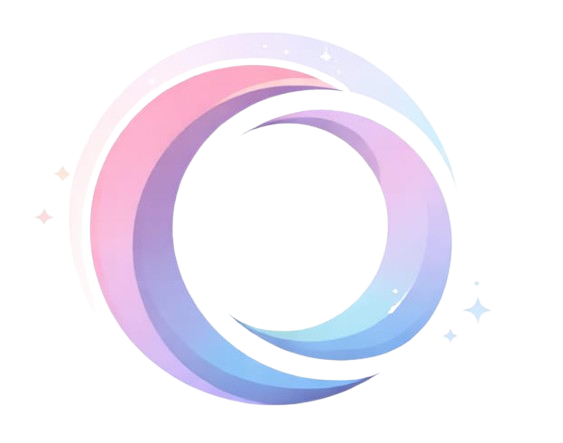

# 🩺 OncoCare — Plataforma de Saúde Oncológica

<div align="center">
  
  <br /><br />
  <strong>Cuidado que acolhe, tecnologia que aproxima.</strong>
  <br /><br />

  
  
  
  
</div>

---

## 📌 Sobre o Projeto

O **OncoCare** é uma plataforma mobile-first de saúde oncológica desenvolvida para conectar pacientes e médicos durante o tratamento do câncer. O app oferece acesso rápido a funcionalidades essenciais como registro de sintomas, telemedicina, acompanhamento de tratamento e suporte via inteligência artificial.

---

## ✨ Funcionalidades

### 🔐 Autenticação
- **Login** com e-mail/senha
- **Login com gov.br** (integração com a identidade digital do Governo Federal)
- **Cadastro em 2 etapas** com seleção de perfil:
  - **Paciente**: Nome, CPF, Data de Nascimento, E-mail e Senha
  - **Médico**: Nome, CRM, Especialidade, E-mail e Senha
- Opção de **Cadastro com gov.br** para ambos os perfis

---

### 🏠 Home — Menu Giratório Interativo

O principal diferencial de UI do OncoCare. A tela inicial conta com uma **roleta animada** fixada à esquerda, com dois modos de navegação:

#### Modo 🏠 Home
Ao selecionar o ícone de Casa, o círculo gira suavemente e os 5 botões surgem em **animação cascata** com linhas pontilhadas conectadas ao ícone central:

| # | Tela | Descrição |
|---|------|-----------|
| 1 | **Sintomas** | Registre sintomas diários |
| 2 | **Telemedicina** | Fale com o médico online |
| 3 | **Exames / Consultas** | Veja seus compromissos |
| 4 | **Acompanhamento** | Histórico de tratamento |
| 5 | **Biblioteca** | Conteúdo educativo sobre oncologia |

#### Modo ⚙️ Configurações
Ao girar a roleta para Configurações, surgem outros 5 botões rápidos:

| # | Ação |
|---|------|
| 1 | Meu Perfil |
| 2 | Notificações |
| 3 | Aparência (Modo Escuro) |
| 4 | Segurança (Biometria) |
| 5 | Sair da Conta |

---

### 🤖 OC IA — Assistente de Oncologia

Assistente de chat com motor de respostas baseado em **palavras-chave**, cobrindo **13 categorias** de dúvidas médicas:

- 💊 Quimioterapia e Radioterapia
- 🤒 Sintomas e Efeitos Colaterais
- 🍽️ Alimentação e Nutrição
- 📋 Exames e Resultados
- 🗓️ Consultas e Telemedicina
- 😟 Suporte Emocional e Ansiedade
- 💊 Medicamentos e Horários
- 🏥 Unidades Hospitalares
- 💊 Farmácias Parceiras
- 🛡️ Planos de Saúde
- 👋 Saudações e Agradecimentos

**Diferenciais do chat:**
- ⏳ Indicador de digitação animado (3 bolinhas pulsantes)
- 💡 Chips de sugestão rápida clicáveis
- ✨ Ícone de brilho em cada resposta da IA
- 📜 Auto-scroll para a última mensagem

---

### 📋 Páginas do Aplicativo

| Rota | Página | Descrição |
|------|--------|-----------|
| `/login` | Login | Acesso com e-mail ou gov.br |
| `/cadastro` | Cadastro | Registro de Paciente ou Médico |
| `/home` | Home | Dashboard principal com menu giratório |
| `/sintomas` | Sintomas | Registro de sintomas diários |
| `/telemedicina` | Telemedicina | Videoconsultas médicas |
| `/exames` | Exames | Histórico de exames e consultas |
| `/acompanhamento` | Acompanhamento | Monitoramento do tratamento |
| `/biblioteca` | Biblioteca | Conteúdo educativo |
| `/unidades` | Unidades Hospitalares | Hospitais especializados próximos |
| `/farmacias` | Farmácias Parceiras | Descontos em medicamentos |
| `/planos` | Planos OncoCare | Planos de assinatura |
| `/assistente` | OC IA | Assistente de inteligência artificial |
| `/configuracoes` | Configurações | Preferências e conta do usuário |

---

### ⚙️ Configurações

Organizada em seções com **toggles interativos**:
- 👤 **Minha Conta**: Editar Perfil e Alterar Senha
- 🔔 **Notificações**: Alertas pelo App e SMS
- 🌙 **Aparência**: Modo Escuro / Claro
- 🔒 **Segurança**: Acesso por Biometria (Face ID / Digital)
- ℹ️ **Sobre**: Termos de Uso e Central de Ajuda
- 🚪 **Sair da Conta**: Logout

---

## 🛠️ Tecnologias Utilizadas

| Tecnologia | Uso |
|------------|-----|
| **React 18** | Framework principal (SPA) |
| **TypeScript** | Tipagem estática |
| **Vite** | Build tool e dev server |
| **react-router-dom** | Roteamento entre páginas |
| **lucide-react** | Biblioteca de ícones |
| **CSS Modular** | Estilização por componente |

---

## 🎨 Design System

- **Estética**: Glassmorphism com fundos translúcidos e blur
- **Paleta**: Gradientes suaves em roxo, azul e rosa pastel
- **Tipografia**: Moderna e limpa para legibilidade em telas pequenas
- **Animações**: CSS puro — `cubic-bezier`, `@keyframes`, `transition`
- **Mobile-first**: Layout otimizado para smartphones

---

## 🚀 Como Executar Localmente

```bash
# 1. Clone o repositório
git clone https://github.com/BrunoSilva77/onco-care-app.git

# 2. Acesse a pasta do projeto
cd onco-care-app

# 3. Instale as dependências
npm install

# 4. Inicie o servidor de desenvolvimento
npm run dev
```

Acesse em: `http://localhost:5173`

---

## 📦 Build para Produção

```bash
npm run build
```

Os arquivos otimizados serão gerados na pasta `dist/`.

---

## 📁 Estrutura do Projeto

```
onco-care-app/
├── public/
│   └── assets/
│       └── images/          # Logo, fundo e ícones
├── src/
│   ├── components/          # Componentes reutilizáveis
│   │   ├── TopBar.tsx       # Barra de topo com voltar
│   │   ├── DropdownMenu.tsx # Menu suspenso (secundário)
│   │   └── FloatingAssistant.tsx
│   ├── pages/               # Uma pasta por tela
│   │   ├── Login.tsx / .css
│   │   ├── Cadastro.tsx / .css
│   │   ├── Home.tsx / .css
│   │   ├── AssistenteIA.tsx / .css
│   │   ├── Configuracoes.tsx / .css
│   │   └── ... (demais páginas)
│   ├── App.tsx              # Definição de todas as rotas
│   └── main.tsx             # Ponto de entrada
├── package.json
└── vite.config.ts
```

---

## 🔮 Próximos Passos

- [ ] Integração com API de autenticação real (gov.br OAuth)
- [ ] Integração do OC IA com API de LLM (ex: Google Gemini)
- [ ] Persistência de dados com backend (Node.js + PostgreSQL)
- [ ] Notificações push para lembretes de medicamentos
- [ ] Implementação real de videochamada na Telemedicina
- [ ] Dark Mode funcional em todo o app
- [ ] Publicação na Play Store e App Store (React Native ou PWA)

---

## 👨‍💻 Autor

Desenvolvido por **Bruno Silva**

[](https://github.com/BrunoSilva77)

---

<div align="center">
  <sub>Feito com 💜 para ajudar pacientes e profissionais de oncologia.</sub>
</div>
